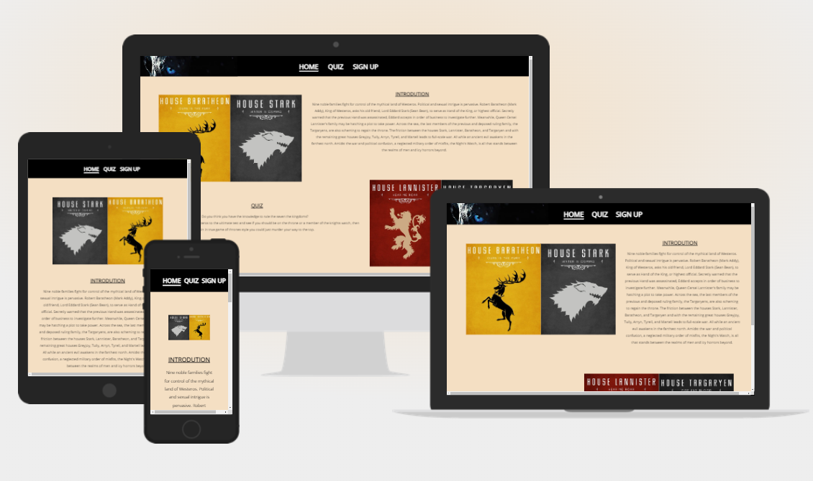
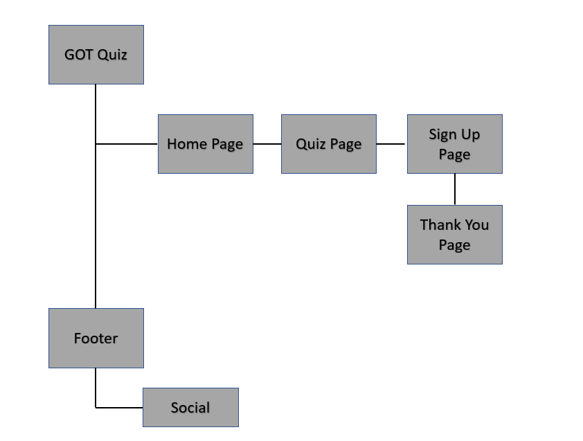
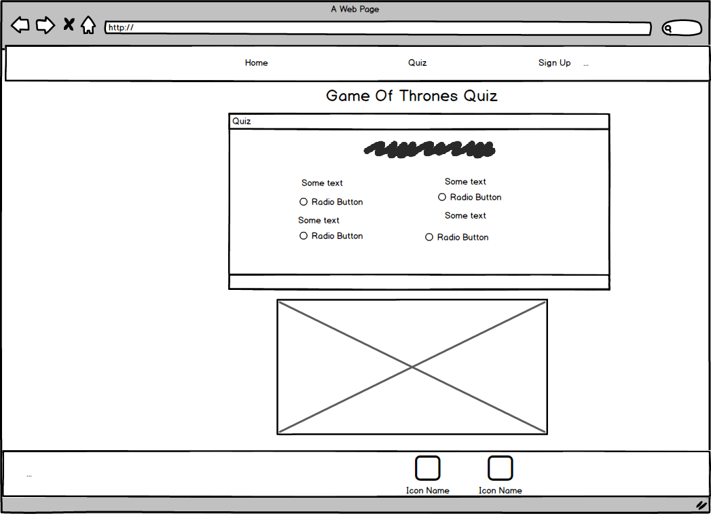
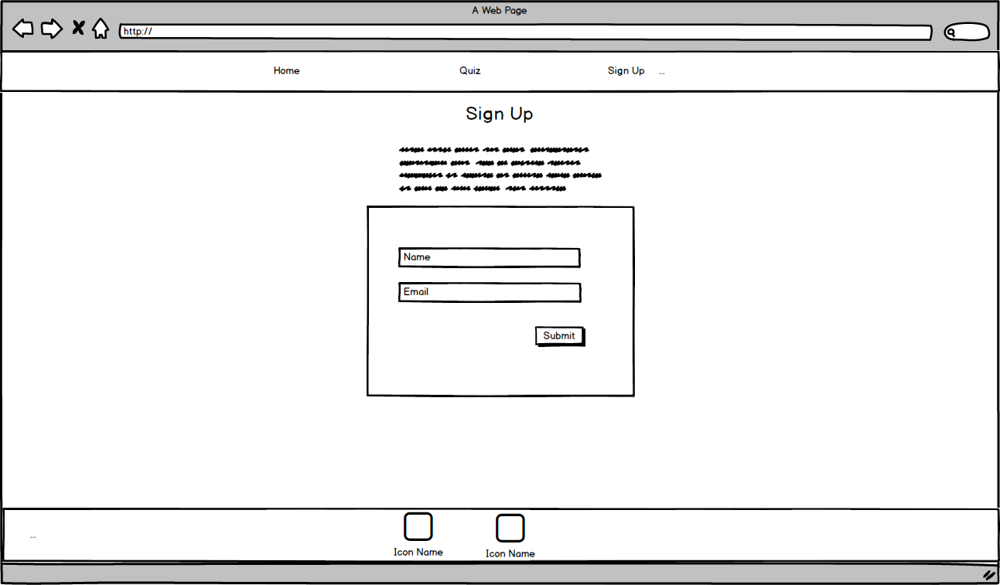

# GOT Quiz

[View The Live Project Here]()

## Table Of Contents
1. [Introduction](#Introduction)
2. [UX](#UX)
    1. [Ideal User Demographic](#Ideal-User-Demographic)
    2. [User Stories](#User-Stories)
    3. [Development Planes](#Development-Planes)
    4. [Design](#Design)
3. [Features](#Features)
    1. [Design Features](#Design-Features)
    2. [Existing Features](#Existing-Features)
    3. [Features to Implement in the future](#Features-to-Implement-in-the-future)
4. [Issues and Bugs](#Issues-and-Bugs)
5. [Technologies Used](#Technologies-Used)
    1. [Main Languages Used](#Main-Languages-Used)
    2. [Frameworks, Libraries & Programs Used](#Frameworks,-Libraries-&-Programs-Used)
6. [Testing](#Testing)
    1. [Testing.md](TESTING.md)
7. [Deployment](#Deploment)
    1. [Deploying on GitHub Pages](#Deploying-on-GitHub-Pages)
8. [Credits](#Credits)
    1. [Content](#Content)
    2. [Media](#Media)
    3. [Code](#Code)
9. [Acknowledgements](#Acknowledgements)

***

## Introduction

This website is a quiz created to test your knowledge of the hit show Game Of Thrones that ran for 8 seasons from April 2001 until May 2019, set in the fictional kingdom of westeros. 

This website was made for the first of five Milestone projects required to complete the Diploma in Software development (eCommerce Applications) program at The Code Institute.

The main requirements of this project are to build a responsive and interactive front-end site using all the technologies learned so far, namely HTML5, CSS3 and JavaScript.

## UX
### Ideal User Demographic
The ideal user for this website is:
* Current user
* Gaming user

### User-Stories
#### Current User Goals
1. As a current user, I want to easily navigate through the site and access quiz ease.
2. As a current user, I want to easily navigate to content I have previously viewed within a small number of steps.
3. As a current user, I would like to see new content added to the quiz and questions updated that works with the current format.

#### New User Goals
1. As a new user, I want to easily navigate the entire site intuitively. 
2. As a new user, I want the information I seek to be easily accessible and relevant.
3. As a new user, I want attractive and relevant visuals and colour schemes that work with the content.
4. As a new user, I want to get access to a site that has good accuate questions with correct answers.

### Development-Planes

#### Strategy
Strategy incorporates user needs as well as product objectives. This website will focus on the following target audience, divided into three main categories:
- **Roles:**
    - Current users
    - New users
    - Gaming users

- **Demographic:**
    - All ages
    - Worldwide

#### Scope
The scope plane is about defining requirements based on the goals established on the strategy plane. Using the information in the strategy plane, the identified required features have been broken into the following two categories.
- Content Requirements:
    - The user will be looking for:
        - Accuate questions with correct answers
        - Images from the series
        - Regular quiz updates 
- Functionality Requirements:
    - The user will be able to:
        - Be able to easily navigate the site to find the quiz or information they require.
        - Be able to contact the site to report possible issues and also give suggestions.

#### Structure
The information above was then organized in a hierarchical tree structure, a site map, showing how users can navigate through the site with ease and efficiency, with the following results:

Site Map

#### Skeleton
Wireframes were made to showcase the appearance of the site pages while keeping a positive user experience in mind. The wireframes were created using a desktop version of [Balsamiq](https://balsamiq.com/).

Balsamiq Wireframes

    

   

[Back to top](#GOT-Quiz)

## Features

### Design Features
Each page within the site has a consistent and responsive navigation system. The details of features on the site are detailed below.
- The **Header** is across the top of the page. It is not static as this would cover too much of the screen. A back-to-top button was implemented instead so users can access the navigation bar quickly.
- The **Navigation Bar** is positioned directly below the header.
- The **Footer** is 100% in width and 40px in height. It stays at the bottom of the screen at all times, on all screen sizes. Each social media link opens in a new tab. Additionally, each social media link opens in a new tab to relavent social media page. Each page within the site has a consistent and responsive navigation system. The details of features on the site are detailed below.
- The **Sign Up Form** is to provide a way for users to contact the develper and they can be informed of quiz updates.

### Existing Features
- **Header** - Appearing on almost every page for brand recognition.
- **Navigation Bar** - Appearing on almost every page for a consistently easy and intuitive navigable.
- **Social Media Icons** - Appearing on almost every page, the icons are appropriate representations of the Social Media platforms.
- **Contact Form** - A contact form is used in the Contact Page, to provide a point of contact for the user.
- **[Intro Page](index.html)** - Provides a summary of the TV series game of Thrones and a little quiz introdution.
- **[Quiz Page](quiz.html)** - This page has the Quiz game on it and provides the user with a score at the end.
- **[Sign Up Page](sign-up.html)** - This page provide the user with a place to sign up to get information on when the quiz is updated.
- **[Sin Up Dump Page](sign-up-dump.html)** - This page is were the user is taken after submiting the form in the sign up page.   

### Features to Implement in the future
- **Helpful Links Page**
     - **Feature** - 
     - **Reason for not featuring in this release** - Not enough time to find these out before the submission date also I may not be aware of some of these events.

[Back to top](#GOT-Quiz)

## Issues and Bugs

- **Sign Up Form Background** - Issue with the image not staying central on small screens.
- **Header and Footer Responsivness** - A bug was detected on smaller screens that the header and footer are not filly the width of the screen.

[Back to top](#GOT-Quiz)

## Technologies Used

### Main Lanuages Used
- [HTML5](https://en.wikipedia.org/wiki/HTML5 "Link to HTML Wiki")
- [CSS3](https://en.wikipedia.org/wiki/Cascading_Style_Sheets "Link to CSS Wiki")
- [JavaScript](https://en.wikipedia.org/wiki/JavaScript "Link to JavaScript Wiki")

### Frameworks, Libraries & Programs Used
- [Google Fonts](https://fonts.google.com/ "Link to Google Fonts")
    - Google fonts was used to import the fonts into the style.css file. These fonts were used throughout the project.
- [Favicon](https://icons8.com/ "Link to Favicon Generator")
     - Favicon was used to add an icon to the website tab. These were used throughout the project.
- [Font Awesome](https://fontawesome.com/ "Link to FontAwesome")
     - Font Awesome was used on almost all pages throughout the website to import icons (e.g. social media icons) for UX purposes.
- [GitPod](https://gitpod.io/ "Link to GitPod homepage")
     - GitPod was used for writing code, commiting, and then pushing to GitHub.
- [GitHub](https://github.com/ "Link to GitHub")
     - GitHub was used to store the project after pushing
- [Balsamiq](https://balsamiq.com/ "Link to Balsamiq homepage")
     - Balsamiq was used to create the wireframes during the design phase of the project.

[Back to top](#GOT-Quiz)

## Testing

Testing information can be found in a separate testing [file](TESTING.md "Link to testing file")

### Deploying on GitHub Pages
To deploy this page to GitHub Pages from its GitHub repository, the following steps were taken:

1. Log into [GitHub](https://github.com/login "Link to GitHub login page") or [create an account](https://github.com/join "Link to GitHub create account page").
2. Locate the [GitHub Repository](add link here "Link to GitHub Repo").
3. At the top of the repository, select Settings from the menu items.
4. Scroll down the Settings page to the "Pages" section.
5. Under "Source" click the drop-down menu labelled "None" and select "Main".
6. Upon selection, the page will automatically refresh meaning that the website is now deployed.
7. Scroll back down to the "Pages" section to retrieve the deployed link.

## Credits

### Content
- Some of the text used in variose pages were borrowed and adapted from various sites, Listed below.
     - [Wkipedia](https://wikipedia.com/)
     - [Favicon](https://icons8.com/)
     
### Media
- Almost all the images came from [Wikipedia](https://wikipedia.com/) but also got some from [IWM](https://https://www.iwm.org.uk/) and [Google Pictures](https://photos.google.com/)

### Code
The developer consulted multiple sites in order to better understand the code they were trying to implement. For code that was copied and edited, the developer made sure to reference this with the code. The following sites were used on a more regular basis:
- [Stack Overflow](https://stackoverflow.com/ "Link to Stack Overflow page")
- [W3Schools](https://www.w3schools.com/ "Link to W3Schools page")
- [MDN Docs](https://developer.mozilla.org/ "Link to MDN Web Docs")
- [DevDocs API Documentation](https://devdocs.io/ "Link to DevDocs page")

[Back to top](#GOT-Quiz)

## Acknowledgements

[Back to top](#GOT-Quiz)

***