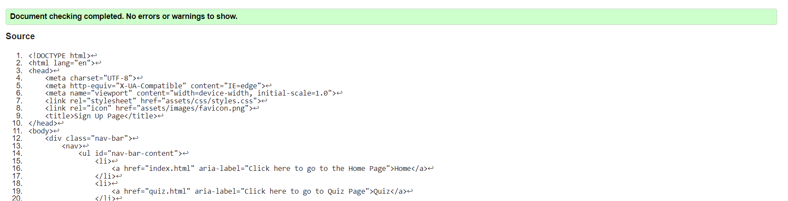

# GOT Quiz Testing 

[Main README.md file](/README.md)

[View live project]()

[View GitHub repository]()

***
## Table of contents
1. [Testing User Stories](#Testing-User-Stories)
2. [Manual Testing](#Manual-Testing)
3. [Automated Testing](#Automated-Testing) 
     - [Code Validation](#Code-Validation)
     - [Accessibility](#Accessibility-Validation)
     - [Browser Validation](#Browser-Validation)
4. [User Testing](#User-Testing)

***

## Testing User Stories

#### Current User Goals:

1. As a current user, I want to easily navigate through the site and access the information I require with ease.

  - The navigation bar is clearly defined and easily navigable for users to find and use.
  - The Quiz is clear and easy to read and all answers are correct, and with regular updates.
  - The footer menu is easy to use with appropriate icons for easy identification.

2. As a current user, I want to easily navigate to content I have previously viewed within a small number of steps.

  - On all site pages there is a naviagtion bar with links to each required page.
  - Each information page has links that bring the user to each section of the page.

#### New User Goals

1. As a new user, I want to easily navigate the entire site intuitively.

  - The navigation bar is clearly defined and easily navigable for users to find and use.
  - The Quiz is clear and easy to read and all answers are correct.
  - The footer menu is easy to use with appropriate icons for easy identification.

2. As a new user, I want the information I seek to be easily accessible and relevant.

  - The navigation bar is clearly defined and easily navigable for users to find and use.
  - The Quiz is clear and easy to read and all answers are correct.
  - The footer menu is easy to use with appropriate icons for easy identification.

3. As a new user, I want attractive and relevant visuals and colour schemes that work with the content.

  - An attractive colour palette was created using [Color Mind](http://colormind.io/ "Link to Color Mind Home Page").
  - Relavant images were found using [Unsplash](https://unsplash.com "Link to Unsplash Home Page") and [Pixabay](https://pixabay.com "Link to Pixabay Home Page").

[Back to top](#GOT-Quiz-Testing)

## Manual Testing

### Common Elements Testing
Manual testing was conducted on the following elements that appear on every page:

- Clicking on the Navigation Bar's links will bring the user to the specified page.

     
    

### Sign Up Page 
Manual testing was conducted on the following elements of the [Sign Up Page](sign-up.html):  

  - When filling out the contact form, the user must complete all fields before submitting

      
      

  - When submitting the form you get directed to the [Sign Up Dump Page](sign-up.html)

       

### Mobile & Tablet Screens

  - On Tablet size screens 1200px or less 
     
     
     

  - On mobile sixe screens 800px or smaller 
     
     
     

[Back to top](#GOT-Quiz-Testing)

## Automated Testing

### Code Validation
The [W3C Markup Validator](https://validator.w3.org/) service was used to validate the `HTML` and `CSS` code used.

**Results:**

- Home Page

      

- Quiz Page

     

- Sign Up Page

     

- Sign Up Dump Page

     

- CSS Code

     

### Accessibility Validation

Lighthouse was used to get accessibility of the site

**Results:**

- Home Page

      

- Quix Page

     

- Sign Up Page

     

- Sign Up Dump Page

     

### Browser Validation
- Chrome - [test image](assets/testing-file/validate/validate-chrome.PNG)
- Edge - [test image](assets/testing-files/validate/validate-edge.PNG)
- Firefox - [test image](assets/testing-files/validate/validate-firefox.PNG)

## User testing 

[Back to top](#GOT-Quiz-Testing)

***